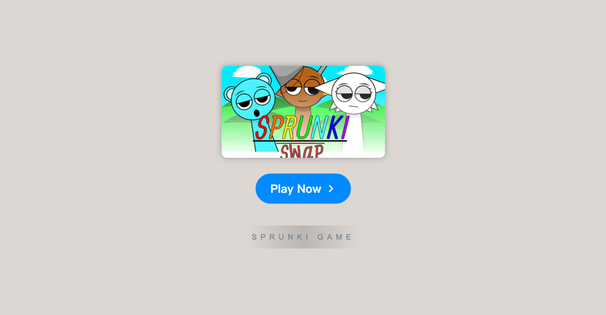

# Sprunki: Swapped Version

    

Welcome to **[Sprunki: Swapped Version](https://sprunkionline.com/swapped-version)**, a fan-made mod that redefines the traditional **Sprunki Incredibox** experience. This unique version transforms characters by swapping their sounds, roles, and animations, creating an entirely fresh approach to music-making and game interaction. Dive into this exciting twist where familiar faces take on surprising new roles, and discover endless combinations of soundscapes.

### Table of Contents
- Introduction
- Game Features
- How to Play
- Character Swaps List
- Visual Changes
- Tips for Exploration
- Related Games & Mods
- Resources

### Introduction

**Sprunki: Swapped Version** introduces a clever twist on the classic Incredibox gameplay. Through character swaps, players can experiment with new roles and sounds for beloved characters, resulting in a refreshing gameplay experience. This mod challenges players to rethink the original Sprunki Incredibox dynamics while enjoying fresh auditory and visual content. Embrace a whole new world of creative music-making with **Sprunki Swap Mod**.

### Game Features

| Feature                    | Description                                                                                 |
|----------------------------|---------------------------------------------------------------------------------------------|
| **Character Swaps**        | Experience familiar characters in new roles and sounds.                                     |
| **Enhanced Sounds**        | Swapped identities bring unique sound palettes for rich musical creativity.                 |
| **Visual Reimagining**     | Characters have new appearances that reflect their swapped roles.                           |
| **Unlockable Bonuses**     | Discover hidden animations and features by combining specific sounds.                       |
| **Browser-Based Gameplay** | Play directly in your browser with no download required.                                    |
| **Community Sharing**      | Save, share, and receive feedback from a community of music enthusiasts.                    |

### How to Play

Playing **Sprunki Swap Mod** retains the rhythm-based mechanics of Incredibox while adding a twist to each character:

1. **Drag and Drop**: Select characters and place them in the lineup to create your music.
2. **Explore New Soundscapes**: With swapped identities, each character brings a fresh sound, encouraging experimentation.
3. **Unlock Surprises**: Combine specific characters to reveal hidden features and new animations.

Visit related games like **[Sprunki: Mr. Fun Computers](https://sprunkionline.com/mr-fun-computers)** and **[Sprunki Punch](https://sprunkionline.com/punch)** for more musical exploration.

### Character Swaps List

Here’s a breakdown of the character swaps in **Sprunki: Swapped Version**:

- **Orange (Oren)** ↔ **Red (Raddy)**
- **Silver (Clukr)** ↔ **Gold (Garnold)**
- **Fun Bot** ↔ **Mr. Fun Computer**
- **Green (Vinera)** ↔ **Lime (OWAKCX)**
- **Gray** ↔ **White (Wenda)**
- **Brown (Brud)** ↔ **Yellow (Simon)**
- **Sky Blue (Sky)** ↔ **Pink (Pinki)**
- **Mr. Sun** → Reimagined as **Mr. Moon**
- **Purple (Durple)** ↔ **Tan (Tunner)**
- **Mr. Tree** → Reimagined as **Autumn Tree**

Each character swap introduces new soundscapes and beats, with animations tailored to fit their new identities. Discover how these swaps add complexity to your musical creations!

### Visual Changes

The swapped characters come with reimagined visuals that match their new roles, adding fresh aesthetic appeal. From the autumn-themed **Mr. Tree** to the moon-inspired **Mr. Sun**, each reinterpreted character enhances the overall game atmosphere, making **Sprunki Swap Mod** a visually delightful experience.

### Tips for Exploration

- **Experiment with Different Swaps**: Mixing unfamiliar character sounds can lead to unexpected and exciting results.
- **Watch Tutorials**: Find YouTube guides for mastering various sound combinations.
- **Engage with the Community**: Share your creations, get feedback, and be inspired by other players.

### Related Games & Mods

For more Sprunki mods and game modes, check out:

- [Incredibox Mods](https://sprunkionline.com/category/incredibox-mods)
- [Sprunki Mods](https://sprunkionline.com/category/sprunki-mods)

### Resources

Explore the official sites for more modes and updates:

- [Sprunki Phase](https://sprunkionline.com/category/sprunki-phase)
- [Sprunki: Swapped Version](https://sprunkionline.com/swapped-version)

Unleash your creativity in the whimsical world of Sprunki!
